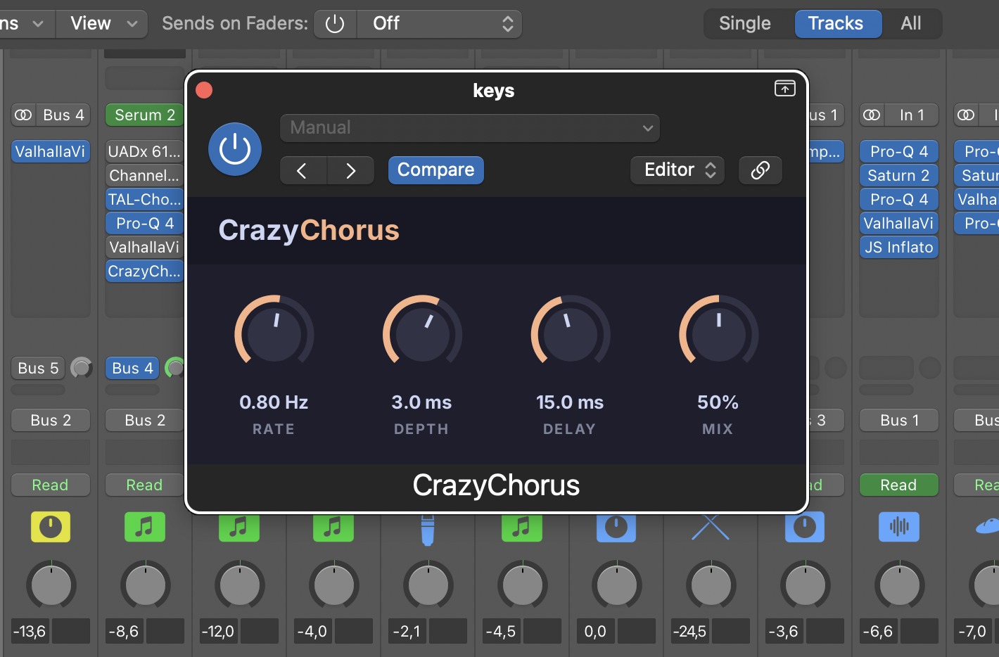

# CrazyChorus

A stereo chorus audio plugin written in Rust with the [truce](https://truce.audio) framework.
It builds as AU (for Logic Pro), VST3, CLAP and a standalone app.



## About

This is an educational project. I built it to get better at DSP, to write audio code in Rust, and to try a
new plugin framework. The DSP (delay line, LFO, chorus) is written by hand, with no audio libraries.

## Controls

| Knob  | Range        | Default |
|-------|--------------|---------|
| Rate  | 0.1 to 5 Hz  | 0.8 Hz  |
| Depth | 0 to 5 ms    | 2 ms    |
| Delay | 7 to 25 ms   | 15 ms   |
| Mix   | 0 to 100%    | 50%     |

Drag a knob up or down to change it. Hold Shift for fine control, scroll to nudge, double-click to reset.

## How it works

Each channel has its own delay line, read at a position that moves with a sine LFO:
`delay = base + depth * lfo`. The right LFO runs a quarter cycle ahead of the left one, which gives the
stereo width. Fractional delay reads use 4-point cubic Hermite interpolation.

## Codebase

- `src/dsp/`: the DSP, plain Rust with no framework types, so it can be unit tested on its own.
  - `delay_line.rs`: power-of-two ring buffer with integer and fractional (Hermite) reads.
  - `lfo.rs`: sine LFO with the phase kept in cycles.
  - `chorus.rs`: two delay lines and two LFOs, plus parameter handling and the dry/wet mix.
- `src/lib.rs`: the truce plugin. Parameters, smoothing, bus layouts and the editor.
- `ui/main.slint`: the GUI, written in [Slint](https://slint.dev).
- `tests/plugin.rs`: plugin-level tests run through truce's test driver, no DAW needed.
- `vendor/truce-slint/`: a patched copy of truce's Slint backend, so a knob drag keeps going when the cursor
  leaves the window.

Some rules the code follows:

- No allocation, locks or logging on the audio thread.
- Every parameter on the delay path is smoothed, to avoid clicks.
- Setters clamp their input and turn NaN into a safe value, so the audio path never sees bad numbers.
- Mix at 0% is a bit-exact passthrough.

## Design

The GUI uses the [Catppuccin](https://catppuccin.com/palette) Mocha palette with peach accents, and the Inter
font.

## Building

Requires Rust 1.92+ and macOS for the AU build.

```sh
cargo install cargo-truce
cargo truce install --au2   # or --vst3, --clap
cargo truce run             # standalone, no DAW needed
cargo test
```
